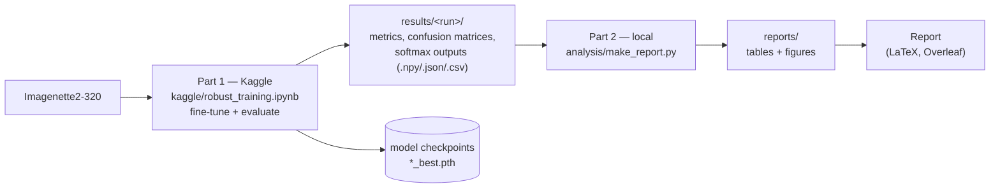
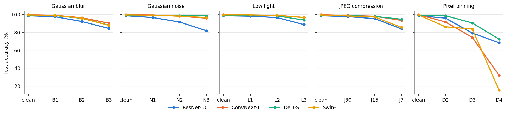
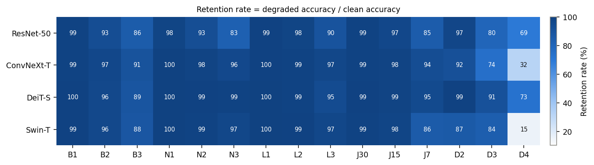

# Robust Image Recognition under Realistic Image Degradations

Final project, Deep Learning course 2026.

We fine-tune four ImageNet-pretrained backbones (ResNet-50, ConvNeXt-T, DeiT-S, Swin-T) on clean
Imagenette images and measure how their accuracy degrades under five realistic corruptions
(Gaussian blur, Gaussian noise, low light, JPEG compression, pixel binning), each at three severity
levels. Corruptions are applied **only at test time**.

**Team:**
| Student ID | Name | Class | Github Account |
|---|---|---|---|
| 2410944 | Nguyễn Trương Thịnh | ICT | Thinh Nguyen |
| 2410770 | Nguyễn Hải Phong | ICT | Xx-Pumpkin-xX |
| 2410981 | Lã Thị Bảo Trâm | ICT | Tram-Stack |
| 2410965 | Trần Thị Thu Trang | ICT | pieflavored-pie |
| 2410703 | Trịnh Phương Nam | ICT | PIIKASONIC |
| 2410559 | Đỗ Hoàng Long | DS | hlongg |
| 2410980 | Lê Thành Trà | DS | Thanh Trà Lê |

## Pipeline

The work is split into two parts that communicate only through the `results/` folder.



| | Input | Output |
|---|---|---|
| **Part 1 — Kaggle** (GPU) | Imagenette2-320 | `*_best.pth` checkpoints, `results/<run>/` (`.npy`, `.json`, `.csv`) |
| **Part 2 — local** (CPU) | `results/<run>/` | `reports/tables/` (`.csv`, `.md`, `.tex`), `reports/figures/` (`.png`) |

## Repository structure

```
├── README.md
├── DATA.md                  dataset source, version, split, preprocessing, corruptions
├── requirements.txt
├── kaggle/
│   └── robust_training.ipynb    Part 1: data split, training, corrupted evaluation
├── results/
│   └── run_fix_data_leak/       raw output of Part 1 (kept unchanged)
├── analysis/
│   ├── kaggle_results.py        loader for a results folder
│   └── make_report.py           Part 2: results -> tables + figures
└── reports/
    ├── tables/                  generated tables (.csv / .md / .tex)
    ├── figures/                 generated figures (.png)
    └── report/                  final report (PDF)
```

## Part 1 — Training and evaluation (Kaggle)

1. Create a Kaggle notebook from `kaggle/robust_training.ipynb`.
2. Add the dataset **imagenette2-320** as input (see [DATA.md](DATA.md)).
3. Settings: **Accelerator = GPU T4**, **Internet = On** (pretrained weights are downloaded).
4. Run the data-check cell, then check the paths and class folders in Block 1.
5. Edit `CONFIG` in the last cell if needed (models, epochs, run name), then
   **Save Version → Save & Run All**.
6. Download `<run_name>.zip` from the version's **Output** tab and unzip it into `results/`.

Training settings used for the reported run: 10 epochs, AdamW (lr 1e-4, weight decay 0.05),
batch size 64, 1-epoch linear warm-up + cosine schedule, mixed precision, seed 42.
The best epoch is selected on the validation split (clean images only).

## Part 2 — Tables and figures (local)

```bash
pip install -r requirements.txt          # only numpy, pandas, matplotlib are needed for Part 2
python analysis/make_report.py           # default: results/run_fix_data_leak, mCE baseline ResNet-50
```

This regenerates everything in `reports/tables/` and `reports/figures/` and the results table below.

## Results

<!-- RESULTS:START -->
_Generated by `analysis/make_report.py` from `results/run_fix_data_leak` (test set: 3925 images, mCE baseline: ResNet-50)._

| Model | Clean acc | Precision | Recall | F1 | CE loss | mCA | Retention | Conf. drop | mCE |
|---|---|---|---|---|---|---|---|---|---|
| ResNet-50 | 98.55 | 98.54 | 98.55 | 98.54 | 0.045 | 89.80 | 91.13 | 6.93 | 100.0 |
| ConvNeXt-T | **99.69** | **99.70** | **99.69** | **99.69** | **0.015** | 90.77 | 91.05 | 5.57 | 66.2 |
| DeiT-S | 99.21 | 99.22 | 99.21 | 99.21 | 0.026 | **94.83** | **95.58** | **2.96** | **47.7** |
| Swin-T | 99.46 | 99.46 | 99.46 | 99.46 | 0.017 | 89.17 | 89.64 | 5.68 | 80.3 |

Test set: 3925 images. Clean acc / precision / recall / F1 / mCA / retention in %, CE loss = cross-entropy on clean images, conf. drop in percentage points of mean max-softmax, mCE relative to ResNet-50 (= 100, lower is better).
<!-- RESULTS:END -->

Metric definitions are in [`analysis/make_report.py`](analysis/make_report.py) and in the report.
Accuracy vs severity follows Hendrycks & Dietterich (2019); their Corruption Error (mCE) is computed
relative to ResNet-50 because AlexNet is not part of this study.

### Accuracy vs severity


### Retention rate per condition


More: [per-degradation accuracy](reports/tables/accuracy_per_degradation.md) ·
[corruption error](reports/tables/corruption_error.md) ·
[retention and critical severity point](reports/tables/retention_csp.md) ·
[accuracy vs severity (full)](reports/tables/accuracy_vs_severity.md) ·
[per-class F1](reports/tables/per_class_f1.md) ·
[confusion matrices](reports/figures/) ·
[training curves](reports/figures/training_curves.png)

## Trained models

Checkpoints (`*_best.pth`, ~90–110 MB each) are not included to keep the repository small.
They can be reproduced by running Part 1 with the settings above.

## Report

The report is written in LaTeX on Overleaf; the final PDF will be in [`reports/report/`](reports/report/).
It uses the tables in `reports/tables/*.tex` and the figures in `reports/figures/`.
Full references and appendix are in the report.
